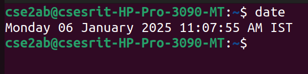
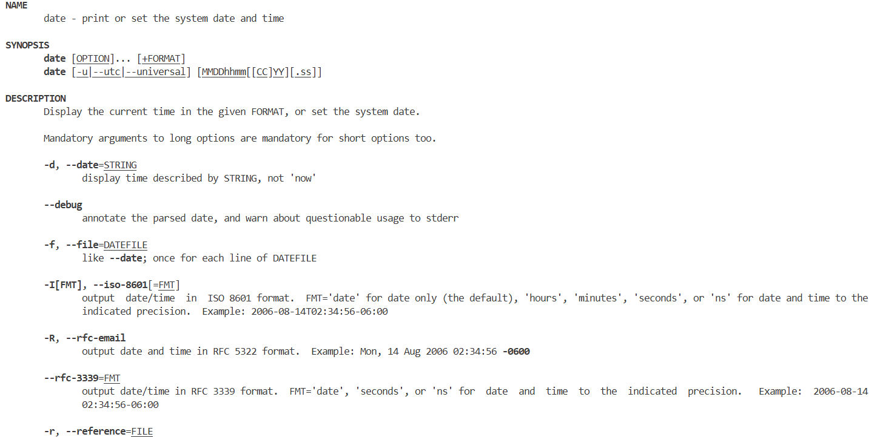
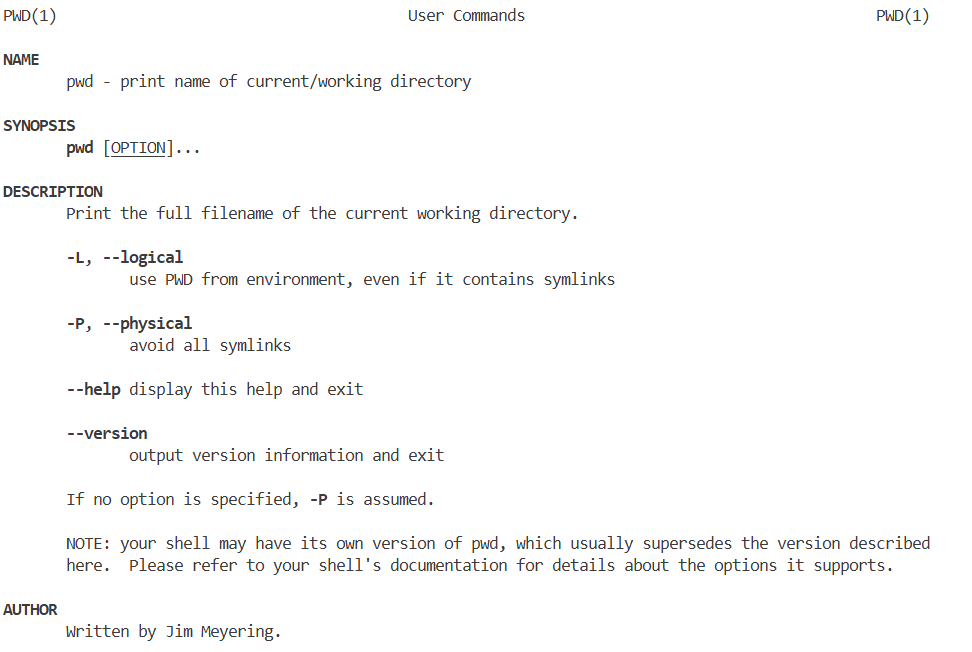
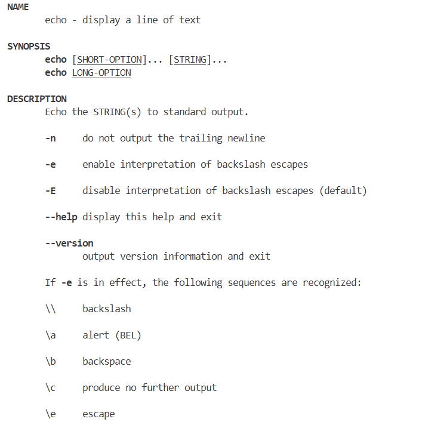
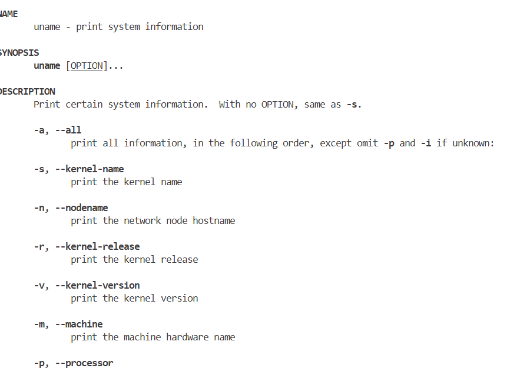
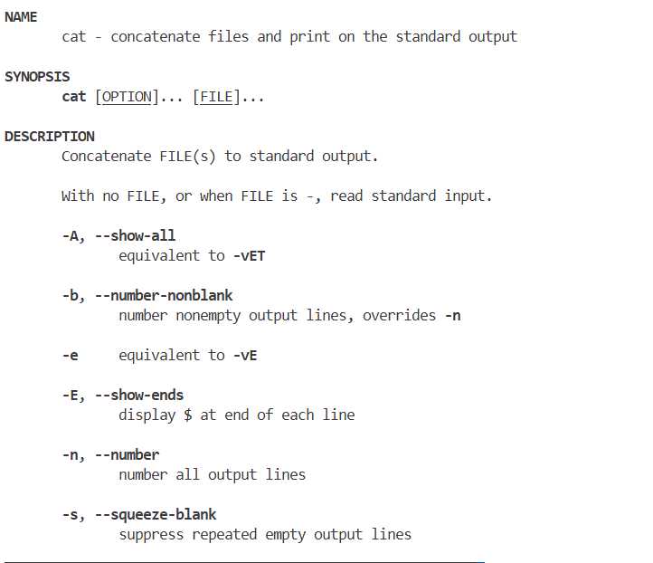
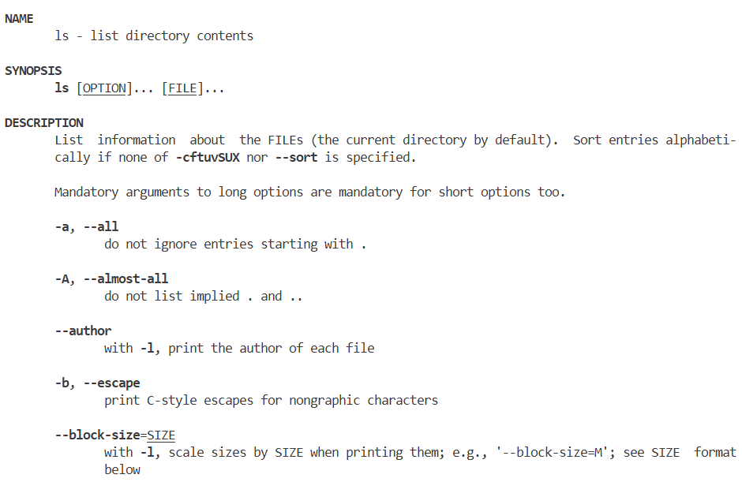

# OS_LAB
Operating System Lab
#Basic linux practice
#general command outputs
# date command output

# pwd command output

# echo command output

# uname command output

# mkdir command output

# cat command output

# cp command output

# ls command output

